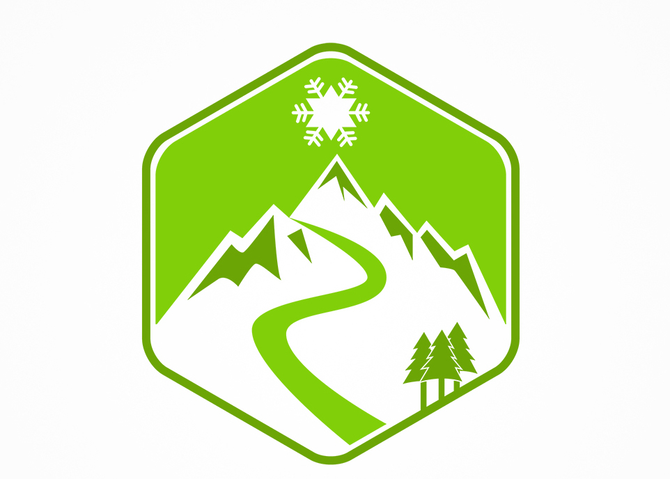

# 

## Getting started

To get the frontend running locally:

- Clone this repo
- `npm install` to install all req'd dependencies
- `npm start` to start the local server (this project uses create-react-app)

### Making requests to the backend API

If you want to change the API URL to a local server, simply edit `src/agent.js` and change `API_ROOT` to the local server's URL (i.e. `http://localhost:3000/api`)

Front End Deployed like this:
Maybe try this on GCP?
https://www.youtube.com/watch?v=PnIjfte7284